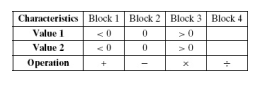

# Use the following characteristics and blocks for the questions below
**(a)Give tests to satisfy the Each Choice criterion<br>
(b)Give tests to satisfy the Base Choice criterion. Assume base
choices are Value 1 = > 0, Value 2 = > 0, and Operation = +.<br>
(c)How many tests are needed to satisfy the All Combinations
criterion? (Do not list all the tests.)<br>
(d)Give tests to satisfy the Pair-Wise Coverage criterion**


```
 a. Give tests to satisfy the *Each Choice* criterion.<br>
There are 4 tests needed: 
(-2, -2, +), (0, 0, -), (2, 2, x), (2, 2, /)

 b. Give tests to satisfy the Base Choice criterion.<br>
  Assume base choices are *Value 1* = > 0, *Value 2* = > 0, and *Operation* = +.<br>
  There are eight tests needed:(2, 2, +), (-2, 2, +), (0, 2, +), (2, -2, +)<br>(2, 0, +), (2, 2, -), (2, 2, x), (2, 2, /)<br>
  
 c. How many tests are needed to satisfy the All Combinations criterion?<br>
 There are (3 x 3 x 4) = 36 tests.<br>
 
 d. Give tests to satisfy the Pair-Wise Coverage criterion.<br>
Since each test can accommodate 3 pairs, at least 11 tests are needed. The best solution
involves one extra test, for a total of 12 tests:<br>(-2, -2, +), (-2, 0, -), (-2, 2, x), (2, -2, /),<br>(2, 0, +), (0, 2, -), (0, -2, x), (0, 0, /),<br>(0, 2, +), (2, -2, -), (2, 0, x), (-2, 2, /)
```
